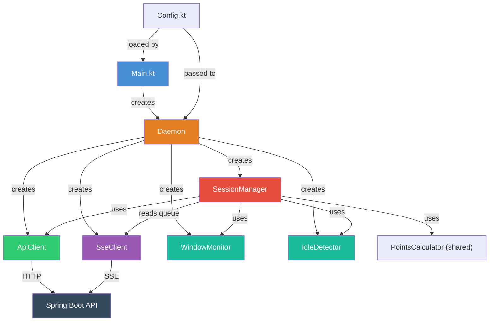
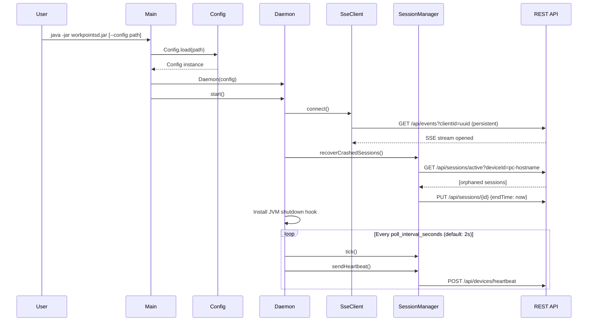
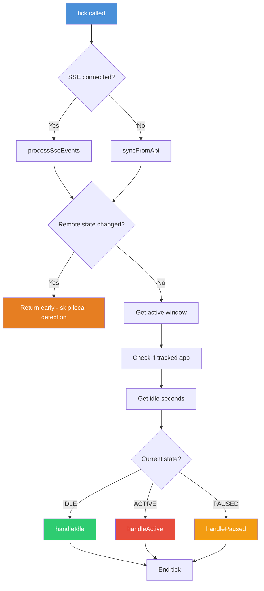
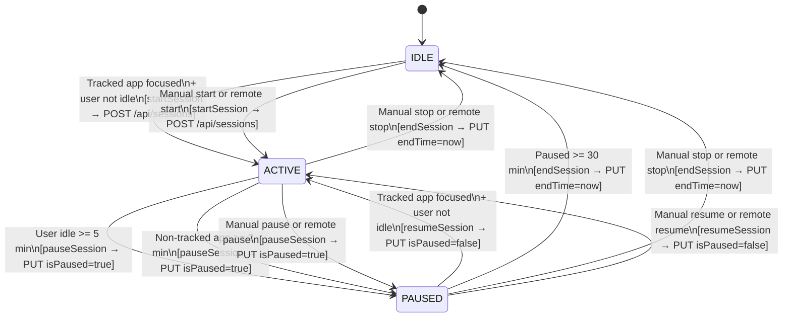
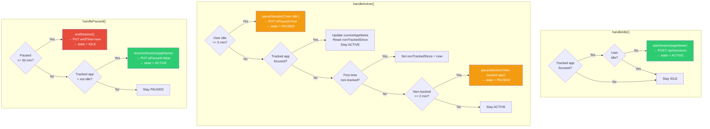
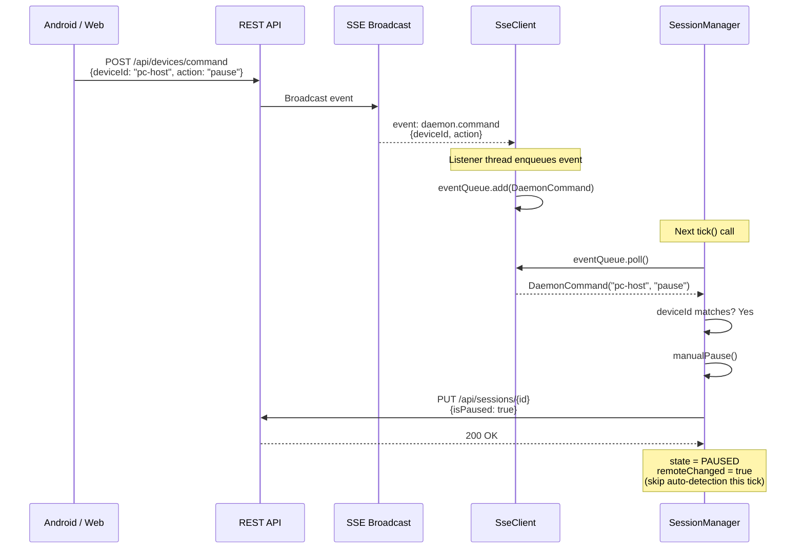
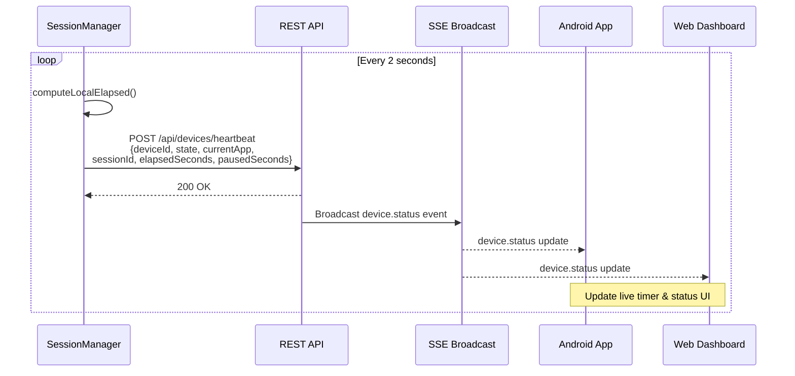
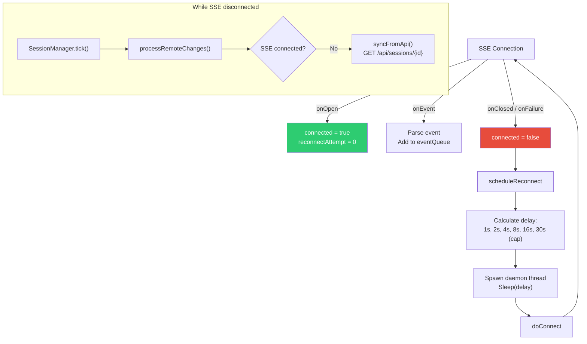
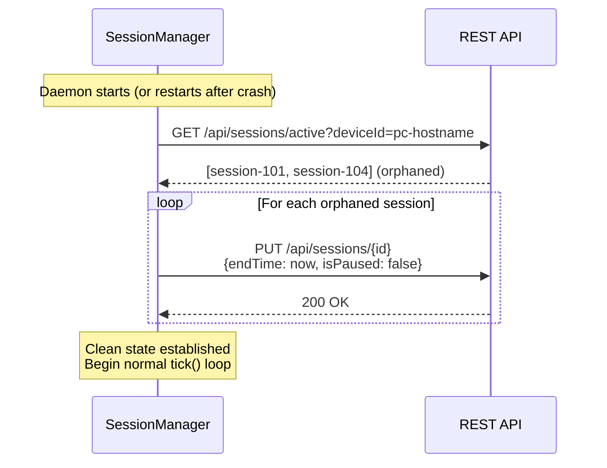
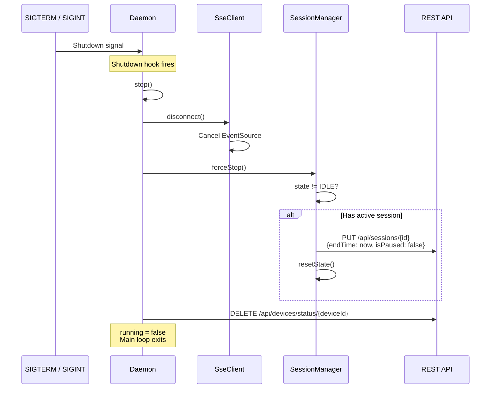

# PC-Client (workpointsd) Documentation

> **workpointsd** is a Linux background daemon that automatically tracks work sessions by detecting
> which application is in focus, monitoring user idle time, and syncing state with a remote REST API
> in real time. It is part of the **streak-pay** work-points gamification system.

---

## Table of Contents

1. [Overview](#1-overview)
2. [Architecture](#2-architecture)
3. [Component Reference](#3-component-reference)
   - [Main (Entry Point)](#31-main-entry-point)
   - [Daemon (Orchestrator)](#32-daemon-orchestrator)
   - [SessionManager (State Machine)](#33-sessionmanager-state-machine)
   - [WindowMonitor (App Detection)](#34-windowmonitor-app-detection)
   - [IdleDetector (Idle Time)](#35-idledetector-idle-time)
   - [SseClient (Real-Time Events)](#36-sseclient-real-time-events)
   - [ApiClient (HTTP Client)](#37-apiclient-http-client)
   - [Config (YAML Loader)](#38-config-yaml-loader)
4. [Flow Diagrams](#4-flow-diagrams)
   - [Startup Sequence](#41-startup-sequence)
   - [Main Poll Loop (tick)](#42-main-poll-loop-tick)
   - [Session State Machine](#43-session-state-machine)
   - [Auto-Detection Flow](#44-auto-detection-flow)
   - [Remote Sync via SSE](#45-remote-sync-via-sse)
   - [Cross-Device Heartbeat Sync](#46-cross-device-heartbeat-sync)
   - [SSE Reconnection](#47-sse-reconnection)
   - [Crash Recovery](#48-crash-recovery)
   - [Shutdown Sequence](#49-shutdown-sequence)
5. [Data Models](#5-data-models)
6. [API Endpoints](#6-api-endpoints)
7. [Configuration](#7-configuration)
8. [Build & Deployment](#8-build--deployment)
9. [Testing](#9-testing)
10. [Technology Stack](#10-technology-stack)

---

## 1. Overview

The pc-client is a headless JVM daemon (`workpointsd`) designed for Linux desktops. Its primary
responsibilities are:

- **Automatic session tracking** -- Detects when a tracked application (IDE, terminal, browser, etc.)
  has focus and starts/pauses/resumes/ends work sessions accordingly.
- **Idle detection** -- Monitors keyboard and mouse activity to auto-pause sessions when the user
  steps away.
- **API synchronization** -- Persists all session state to a Spring Boot REST API (PostgreSQL backend).
- **Real-time multi-device sync** -- Receives remote commands and session updates via Server-Sent Events
  (SSE), and pushes local state via periodic heartbeats.
- **Crash recovery** -- On startup, detects and closes orphaned sessions left by previous crashes.

### Where pc-client fits in the system

```
                                                 +-----------+
                                                 | PostgreSQL|
                                                 +-----+-----+
                                                       |
+-------------+     REST/SSE     +-------------+       |
|  pc-client  | <=============> |  Spring Boot | <-----+
| (workpointsd)|                |   REST API   |
+-------------+                 +------+-------+
                                       |
                        +--------------+--------------+
                        |              |              |
                  +-----+----+  +-----+----+  +------+------+
                  | Android  |  |   Web    |  |  Other PC   |
                  |   App    |  | Dashboard|  |  Daemons    |
                  +----------+  +----------+  +-------------+
```

---

## 2. Architecture

### Project Structure

```
pc-client/
├── src/main/kotlin/com/workpointstracker/pcclient/
│   ├── Main.kt                          # CLI entry point
│   ├── daemon/
│   │   ├── Daemon.kt                    # Orchestrator & lifecycle
│   │   ├── SessionManager.kt           # Core state machine
│   │   ├── WindowMonitor.kt            # Active window detection
│   │   ├── IdleDetector.kt             # User idle time
│   │   └── SseClient.kt                # SSE event streaming
│   ├── api/
│   │   └── ApiClient.kt                # HTTP REST client
│   └── config/
│       └── Config.kt                   # YAML configuration
├── src/test/kotlin/.../daemon/
│   ├── SessionManagerAutoDetectTest.kt  # Auto-detection tests
│   ├── SessionManagerSseTest.kt         # SSE event tests
│   ├── SessionManagerSyncTest.kt        # API sync tests
│   └── WindowMonitorTest.kt            # Window matching tests
├── build.gradle.kts                     # Shadow JAR build
├── config.example.yaml                  # Configuration template
├── install.sh                           # Installation script
└── workpointsd.service                  # systemd user service
```

### Component Dependency Graph



---

## 3. Component Reference

### 3.1 Main (Entry Point)

**File:** `Main.kt` (45 lines)

Parses CLI arguments, loads configuration and starts the daemon.

**CLI Options:**

| Flag | Description |
|------|-------------|
| `--config <path>`, `-c` | Path to YAML config file |
| `--help`, `-h` | Show usage help |

### 3.2 Daemon (Orchestrator)

**File:** `daemon/Daemon.kt` (68 lines)

The top-level lifecycle controller. It initializes all components, runs the main poll loop, and
handles graceful shutdown.

**Responsibilities:**
- Creates and wires together all components (ApiClient, SseClient, WindowMonitor, IdleDetector, SessionManager)
- Establishes the SSE connection for real-time updates
- Recovers orphaned sessions from previous crashes
- Installs a JVM shutdown hook (SIGTERM / SIGINT)
- Runs the main loop: `tick()` + `sendHeartbeat()` every `poll_interval_seconds`

**Main loop (simplified):**

```kotlin
while (running.get()) {
    sessionManager.tick()
    sessionManager.sendHeartbeat()
    Thread.sleep(config.poll_interval_seconds * 1000L)
}
```

### 3.3 SessionManager (State Machine)

**File:** `daemon/SessionManager.kt` (382 lines)

The core brain of the daemon. Manages a three-state machine and coordinates between local desktop
detection and remote API state.

**States:**

| State | Description |
|-------|-------------|
| `IDLE` | No active session. Waiting for a tracked app to gain focus. |
| `ACTIVE` | Session running. User is working on a tracked app. |
| `PAUSED` | Session exists but paused (user idle or switched to a non-tracked app). |

**Key internal fields:**

| Field | Type | Description |
|-------|------|-------------|
| `deviceId` | `String` | `"pc-<hostname>"` -- unique device identifier |
| `currentSessionId` | `Long?` | API session ID (null when IDLE) |
| `currentAppName` | `String?` | Name of the tracked app in use |
| `sessionStartTime` | `LocalDateTime?` | When the session was created |
| `pausedSince` | `LocalDateTime?` | When the current pause began |
| `totalPausedSeconds` | `Long` | Cumulative pause duration across all pauses |
| `activeElapsedSeconds` | `Long` | Active working time (synced from API) |
| `nonTrackedSince` | `LocalDateTime?` | When user switched to a non-tracked app |

**Key methods:**

| Method | Purpose |
|--------|---------|
| `tick()` | Main polling function. Processes remote changes, then checks window/idle. |
| `processRemoteChanges()` | SSE (primary) or API polling (fallback) for remote state. |
| `processSseEvents()` | Drains SSE event queue; handles commands, updates, deletes. |
| `syncFromApi()` | Fallback polling when SSE is disconnected. |
| `handleIdle()` | IDLE state: start session if tracked app + not idle. |
| `handleActive()` | ACTIVE state: update app name, check for idle/non-tracked pause. |
| `handlePaused()` | PAUSED state: end if too long, resume if tracked + active. |
| `startSession()` | Creates session via API, transitions to ACTIVE. |
| `pauseSession()` | Pauses session via API, transitions to PAUSED. |
| `resumeSession()` | Resumes session via API, transitions to ACTIVE. |
| `endSession()` | Ends session via API, transitions to IDLE. |
| `sendHeartbeat()` | Pushes current state to API every tick. |
| `recoverCrashedSessions()` | Closes orphaned sessions on startup. |
| `manualStart/Pause/Resume/Stop()` | Handlers for remote commands via SSE. |

### 3.4 WindowMonitor (App Detection)

**File:** `daemon/WindowMonitor.kt` (168 lines)

Detects the currently focused application window across multiple Linux desktop environments.

**Supported environments:**

| Environment | Detection Method |
|-------------|-----------------|
| X11 | `xdotool getactivewindow` + `xprop WM_CLASS` |
| GNOME Wayland | `gdbus call` to `org.gnome.Shell.Eval` (JavaScript) |
| Sway | `swaymsg -t get_tree` (JSON parsing) |
| Hyprland | `hyprctl activewindow -j` (JSON parsing) |
| Unknown | Falls back to X11 (XWayland compatibility) |

**Environment detection** uses `XDG_SESSION_TYPE` and `XDG_CURRENT_DESKTOP` environment variables,
evaluated lazily at first use.

**App matching strategies** (per `TrackedApp`):

| Strategy | Match Logic |
|----------|-------------|
| `wm_class` | Exact match on the window's WM_CLASS (case-insensitive) |
| `title_contains` | Substring match on window title (case-insensitive) |

A window is considered tracked if **either** condition matches (OR logic). This supports both native
apps (matched by WM_CLASS) and PWAs/web apps (matched by browser title).

### 3.5 IdleDetector (Idle Time)

**File:** `daemon/IdleDetector.kt` (64 lines)

Measures seconds since the last keyboard or mouse input.

| Environment | Method |
|-------------|--------|
| X11 | `xprintidle` (returns milliseconds since last input) |
| GNOME Wayland | `gdbus call` to `org.gnome.Mutter.IdleMonitor.GetIdletime` |
| Other | Falls back to X11 via XWayland |

Returns `0` on failure (assumes user is active), ensuring the daemon never incorrectly pauses due
to detection errors.

### 3.6 SseClient (Real-Time Events)

**File:** `daemon/SseClient.kt` (140 lines)

Maintains a persistent SSE connection to the API for receiving real-time state changes from other
devices.

**Connection:** `GET /api/events?clientId=<uuid>` with `X-API-Key` header.

**Event types:**

| SSE Event Type | Kotlin Sealed Class | Trigger |
|----------------|-------------------|---------|
| `session.updated` | `SseEvent.SessionUpdated` | Session paused/resumed/edited on another device |
| `session.deleted` | `SseEvent.SessionDeleted` | Session deleted from dashboard |
| `daemon.command` | `SseEvent.DaemonCommand` | Remote start/pause/resume/stop command |
| `heartbeat` | `SseEvent.Heartbeat` | Keepalive (ignored) |

**Thread safety:** Events are placed into a `ConcurrentLinkedQueue<SseEvent>` by the OkHttp listener
thread and drained by `SessionManager.tick()` on the main loop thread.

**Reconnection:** Exponential backoff starting at 1s, doubling up to 30s cap:
`1s -> 2s -> 4s -> 8s -> 16s -> 30s -> 30s -> ...`

### 3.7 ApiClient (HTTP Client)

**File:** `api/ApiClient.kt` (154 lines)

HTTP REST client built on OkHttp 4.12.0 with Jackson for JSON serialization.

**Timeouts:** 10s connect, 10s read, 10s write.

**All requests include:** `X-API-Key` header for authentication.

**Methods:**

| Method | HTTP | Endpoint | Purpose |
|--------|------|----------|---------|
| `createSession()` | POST | `/api/sessions` | Start a new session |
| `updateSession()` | PUT | `/api/sessions/{id}` | Pause/resume/end a session |
| `getSession()` | GET | `/api/sessions/{id}` | Fetch a single session |
| `getActiveSessions()` | GET | `/api/sessions/active?deviceId=...` | Active sessions for a device |
| `sendHeartbeat()` | POST | `/api/devices/heartbeat` | Push device state |
| `removeDeviceStatus()` | DELETE | `/api/devices/status/{deviceId}` | Cleanup on shutdown |

### 3.8 Config (YAML Loader)

**File:** `config/Config.kt` (67 lines)

Loads configuration from a YAML file with sensible defaults for all fields.

**Load order:**
1. Custom path if `--config` flag is provided
2. Default: `~/.config/workpointsd/config.yaml`
3. Falls back to compiled-in defaults if the file does not exist

**Forward compatibility:** Unknown YAML keys are silently ignored
(`FAIL_ON_UNKNOWN_PROPERTIES = false`).

---

## 4. Flow Diagrams

### 4.1 Startup Sequence



### 4.2 Main Poll Loop (tick)



### 4.3 Session State Machine



### 4.4 Auto-Detection Flow

This diagram shows how the three state handlers respond to local desktop state.



### 4.5 Remote Sync via SSE

Shows how a remote command (from Android app or web dashboard) reaches the daemon and gets executed.



### 4.6 Cross-Device Heartbeat Sync

Shows how the daemon's heartbeat keeps other devices updated with the current state.



### 4.7 SSE Reconnection



### 4.8 Crash Recovery



### 4.9 Shutdown Sequence



---

## 5. Data Models

### DaemonState (enum)

```kotlin
enum class DaemonState {
    IDLE,    // No active session
    ACTIVE,  // Session running, user working
    PAUSED   // Session paused (idle or non-tracked app)
}
```

### WindowInfo

```kotlin
data class WindowInfo(
    val wmClass: String,   // X11 WM_CLASS / Wayland app_id
    val title: String      // Window title
)
```

### TrackedApp

```kotlin
data class TrackedApp(
    val name: String,               // Display name (e.g., "VS Code")
    val wm_class: String? = null,   // Match by WM_CLASS (exact, case-insensitive)
    val title_contains: String? = null  // Match by title substring (case-insensitive)
)
```

### SessionDto (API response)

```kotlin
data class SessionDto(
    val id: Long,
    val deviceId: String,
    val startTime: LocalDateTime,
    val endTime: LocalDateTime?,
    val durationMinutes: Long,
    val pointsEarned: Double,
    val type: SessionType,           // DAY_JOB | SIDE_WORK | EARLY_MORNING
    val isPaused: Boolean,
    val pausedAt: LocalDateTime?,
    val totalPausedSeconds: Long,
    val activeElapsedSeconds: Long
)
```

### SseEvent (sealed class)

```kotlin
sealed class SseEvent {
    data class SessionUpdated(val session: SessionDto) : SseEvent()
    data class SessionDeleted(val id: Long) : SseEvent()
    data class DaemonCommand(val deviceId: String, val action: String) : SseEvent()
    data object Heartbeat : SseEvent()
}
```

### SessionType (from shared module)

```kotlin
enum class SessionType {
    DAY_JOB,       // Mon-Fri 9am-4pm:  0.25 pts/hr
    SIDE_WORK,     // Other times:       1.0  pts/hr
    EARLY_MORNING  // 5am-8am:           1.5  pts/hr
}
```

### Timing Computation

```
activeElapsedSeconds = (now - sessionStartTime) - totalPausedSeconds

Where:
  sessionStartTime   = When the session was created
  totalPausedSeconds = Sum of all pause durations (accumulated across resume cycles)
  pausedSince        = When the current pause began (null if active)
```

---

## 6. API Endpoints

All requests require the `X-API-Key` header.

### Session Management

| Method | Endpoint | Request Body | Response | Used By |
|--------|----------|-------------|----------|---------|
| `POST` | `/api/sessions` | `{deviceId, startTime, type}` | `SessionDto` | `startSession()` |
| `PUT` | `/api/sessions/{id}` | `{isPaused?, pausedAt?, totalPausedSeconds?, endTime?}` | `SessionDto` | `pauseSession()`, `resumeSession()`, `endSession()` |
| `GET` | `/api/sessions/{id}` | -- | `SessionDto` | `syncFromApi()` |
| `GET` | `/api/sessions/active?deviceId=...` | -- | `List<SessionDto>` | `recoverCrashedSessions()` |

### Device Management

| Method | Endpoint | Request Body | Used By |
|--------|----------|-------------|---------|
| `POST` | `/api/devices/heartbeat` | `{deviceId, state, currentApp, sessionId, elapsedSeconds, pausedSeconds}` | `sendHeartbeat()` |
| `DELETE` | `/api/devices/status/{deviceId}` | -- | Shutdown cleanup |

### SSE Stream

| Method | Endpoint | Description |
|--------|----------|-------------|
| `GET` | `/api/events?clientId=<uuid>` | Persistent SSE connection for real-time events |

---

## 7. Configuration

### Config File Location

| Priority | Path |
|----------|------|
| 1 | Custom path via `--config` / `-c` flag |
| 2 | `~/.config/workpointsd/config.yaml` |
| 3 | Built-in defaults (no file needed) |

### Full Configuration Reference

```yaml
# API connection settings
api:
  base_url: "http://localhost:8080"       # Spring Boot API URL
  api_key: "dev-api-key-change-in-production"  # Authentication key

# Polling & timing thresholds
poll_interval_seconds: 2       # How often to check window/idle (seconds)
idle_timeout_seconds: 300      # Seconds idle before auto-pause (5 min)
end_after_paused_seconds: 1800 # Seconds paused before ending session (30 min)
non_tracked_grace_seconds: 120 # Seconds on non-tracked app before pause (2 min)

# Applications to track
tracked_apps:
  - name: "VS Code"
    wm_class: "code"                     # Match by WM_CLASS
  - name: "IntelliJ IDEA"
    wm_class: "jetbrains-idea"
  - name: "Microsoft Teams"
    wm_class: "teams-for-linux"
  - name: "Microsoft Teams"
    title_contains: "Microsoft Teams"    # Match by window title (PWA)
  - name: "Notion"
    title_contains: "Notion"
  - name: "Firefox"
    wm_class: "firefox"
  # ... see config.example.yaml for all defaults
```

### Default Tracked Apps (16 entries)

| App | Match Strategy | Value |
|-----|---------------|-------|
| VS Code | `wm_class` | `code` |
| IntelliJ IDEA | `wm_class` | `jetbrains-idea` |
| PyCharm | `wm_class` | `jetbrains-pycharm` |
| Android Studio | `wm_class` | `jetbrains-studio` |
| Microsoft Teams | `wm_class` | `teams-for-linux` |
| Microsoft Teams | `title_contains` | `Microsoft Teams` |
| Outlook | `title_contains` | `Outlook` |
| Slack | `wm_class` | `slack` |
| Zoom | `wm_class` | `zoom` |
| Obsidian | `wm_class` | `obsidian` |
| Notion | `title_contains` | `Notion` |
| Terminal (GNOME) | `wm_class` | `Gnome-terminal` |
| Kitty | `wm_class` | `kitty` |
| Alacritty | `wm_class` | `Alacritty` |
| Firefox | `wm_class` | `firefox` |
| Chrome | `wm_class` | `google-chrome` |

### Finding WM_CLASS for a New App

On X11:

```bash
# Click on the window you want to identify
xprop WM_CLASS
# Output: WM_CLASS(STRING) = "instance_name", "ClassName"
# Use the ClassName value (second string)
```

On GNOME Wayland:

```bash
gdbus call --session --dest org.gnome.Shell \
  --object-path /org/gnome/Shell \
  --method org.gnome.Shell.Eval \
  "global.get_window_actors().map(a => a.meta_window).filter(w => w.has_focus()).map(w => w.get_wm_class())"
```

---

## 8. Build & Deployment

### Prerequisites

- JDK 17+
- Gradle (wrapper included)
- Linux desktop with X11 or Wayland (GNOME, Sway, or Hyprland)
- `xdotool` + `xprop` + `xprintidle` (for X11)
- Spring Boot API running and accessible

### Build

```bash
# Build the fat JAR (includes all dependencies)
./gradlew :pc-client:shadowJar

# Output: pc-client/build/libs/workpointsd.jar
```

### Run Directly

```bash
java -jar pc-client/build/libs/workpointsd.jar
java -jar pc-client/build/libs/workpointsd.jar --config /path/to/config.yaml
```

### Automated Installation

```bash
# Run the installer from the repo root
./pc-client/install.sh
```

The installer:
1. Builds the shadow JAR
2. Copies the JAR to `~/.local/lib/workpointsd.jar`
3. Creates config at `~/.config/workpointsd/config.yaml` (if missing)
4. Creates log directory at `~/.local/share/workpointsd/`
5. Installs systemd user service
6. Enables auto-start on login

### systemd Service Management

```bash
# Start the daemon
systemctl --user start workpointsd

# Check status
systemctl --user status workpointsd

# Stop the daemon
systemctl --user stop workpointsd

# Disable auto-start
systemctl --user disable workpointsd

# View live logs
journalctl --user -u workpointsd -f

# View recent logs
journalctl --user -u workpointsd --since "1 hour ago"
```

### systemd Service File

```ini
[Unit]
Description=Work Points Tracker Daemon
After=network-online.target
Wants=network-online.target

[Service]
Type=simple
ExecStart=%h/.sdkman/candidates/java/current/bin/java -jar %h/.local/lib/workpointsd.jar
Restart=on-failure
RestartSec=10
Environment=DISPLAY=:0

[Install]
WantedBy=default.target
```

Key details:
- `%h` expands to the user's home directory
- `Restart=on-failure` auto-restarts on crashes (with 10s delay)
- `Environment=DISPLAY=:0` required for X11 tool access
- `WantedBy=default.target` starts on user login

---

## 9. Testing

### Test Framework

- **JUnit 5** for test execution
- **MockK** for Kotlin-native mocking

### Running Tests

```bash
./gradlew :pc-client:test
```

### Test Suites

| Test File | Focus | Key Scenarios |
|-----------|-------|---------------|
| `SessionManagerAutoDetectTest` | Local auto-detection | Start on tracked app, idle pause at 5min, non-tracked pause at 2min, auto-resume, session end at 30min paused |
| `SessionManagerSseTest` | SSE event handling | Session updated/deleted events, DaemonCommand execution, active elapsed sync, remote change skips local detection |
| `SessionManagerSyncTest` | API fallback sync | Polling when SSE disconnected, remote state sync, heartbeat sending, manual controls, crash recovery |
| `WindowMonitorTest` | Window matching | WM_CLASS exact match, title substring, case insensitivity, OR logic, PWA detection, partial match rejection |

### Test Architecture

All tests mock external dependencies (`ApiClient`, `WindowMonitor`, `IdleDetector`, `SseClient`) using
MockK, allowing the `SessionManager` to be tested as a pure state machine without network or desktop
access.

---

## 10. Technology Stack

| Layer | Technology | Version | Purpose |
|-------|-----------|---------|---------|
| Language | Kotlin | 1.9+ | Null-safe, concise JVM language |
| JVM | Java | 17 | Runtime platform |
| Build | Gradle + Shadow Plugin | 8.x | Multi-module build, fat JAR packaging |
| HTTP Client | OkHttp | 4.12.0 | HTTP requests + SSE support |
| SSE | OkHttp SSE | 4.12.0 | Server-Sent Events streaming |
| JSON | Jackson | 2.16.1 | JSON + YAML serialization with Kotlin & JavaTime support |
| YAML | Jackson YAML | 2.16.1 | Configuration file parsing |
| Logging | SLF4J + Logback | 2.0.11 / 1.4.14 | Structured logging |
| Testing | JUnit 5 | 5.10.1 | Test framework |
| Mocking | MockK | 1.13.8 | Kotlin-native mock library |
| Desktop | xdotool, xprop, xprintidle, gdbus | System | Window & idle detection |
| Deployment | systemd | System | Process management & auto-start |
| Shared Logic | `:shared` module | Internal | `PointsCalculator`, `SessionType`, models |
